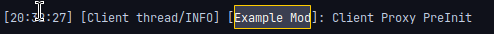

# 主要类与代理

在[重要概念](../core.md)中我们了解过了关于适配器与魔法，这一章节我们将要学习一些魔法的细节。

[**章节相关源码：主类**](https://github.com/AmarokIce/NewbModding1710/blob/ModDev/src/main/java/club/snowlyicewolf/modding1710/ModMain.java)
<br />
[**章节相关源码：代理**](https://github.com/AmarokIce/NewbModding1710/blob/ModDev/src/main/java/club/snowlyicewolf/modding1710/proxy)

## 生命周期事件

`@Mod.EventHandler` 相关的生命周期事件已经在[重要概念](../core.md)中提到过，因此不再赘述。

## 实例与工厂

`@Mod.Instance` 这个魔法注解可以搭配一个 ModID，用于获取目标 Mod 的实例。如果不设置的话默认填充当前 Mod 的实例。
<br />
需要绑定一个静态的，指向目标的字段。

```java title="ModMain.java"
@Mod.Instance(ModMain.ID)
public static ModMain INSTANCE;
```

而与之搭配的是 `@Mod.InstanceFactory`，这个注解允许为你的主要类别提供一个简单工厂。需要绑定一个静态的，以目标为返回值的方法。如果不使用此魔法的话，创建实例时默认为无参数的反射创建。

```java title="ModMain"
@Mod.InstanceFactory
public static ModMain instance() {
    return new ModMain();
}
```

在创建 GUI 时，主类的实例将会决定信号的通道。

## 代理

代理，听起来像是网络代理，实则不然。代理用于处理客户端专用项目与服务端专用项目，但整体会被作为一个单例使用，或者你可以理解为是一种由魔法驱动的工厂。

先不着急写注解，我们先创建一个接口：`IProxy`，创建两个方法：

```java title="IProxy.java"
public interface IProxy {
    void preInit();
    void init();
}
```

然后我们再为客户端与服务端分别实现一个代理，`ClientProxy` 与 `ServerProxy`：

```java title="ClientProxy.java"
@SideOnly(Side.CLIENT)
public final class ClientProxy implements IProxy {
    @Override
    public void preInit() {
        ModMain.LOGGER.info("Client Proxy PreInit");
    }

    @Override
    public void init() {
        ModMain.LOGGER.info("Client Proxy Init");
    }
}
```

```java title="ServerProxy.java"
@SideOnly(Side.SERVER)
public final class ServerProxy implements IProxy {
    @Override
    public void preInit() {
        ModMain.LOGGER.info("Server Proxy PreInit");
    }

    @Override
    public void init() {
        ModMain.LOGGER.info("Server Proxy Init");
    }
}
```

随后，我们再回到主类，创建一个类型为 `IProxy` 的字段，用 `@SidedProxy` 注解绑定：

```java title="ModMain.java"
@SidedProxy(
    serverSide = "club.snowlyicewolf.modding1710.proxy.ServerProxy",
    clientSide = "club.snowlyicewolf.modding1710.proxy.ClientProxy",
    modId = ModMain.ID
)
public static IProxy proxy;
```

此处 Proxy 目标需要用点隔断路径标记，这将会在运行时绑定目标的代理类实例。
<br />
代理可以直接使用，稍后将会在对应端生成对应的实例。

```java title="ModMain.java"
@Mod.EventHandler
public void preInit(FMLPreInitializationEvent event) {
    proxy.preInit();
}

@Mod.EventHandler
public void init(FMLInitializationEvent event) {
    proxy.init();
}
```

再次启动，我们就可以看到日志被输出了：



对于那些对运行端有非常敏感的代码，使用代理可以非常方便的处理问题，例如注册渲染，注册 NEI 等。

??? abstract "你知道吗"
    其实，生命周期事件中的方法 `getSide()` 也可以获取当前所在位置，不过使用代理可以让代码更干净整洁。
