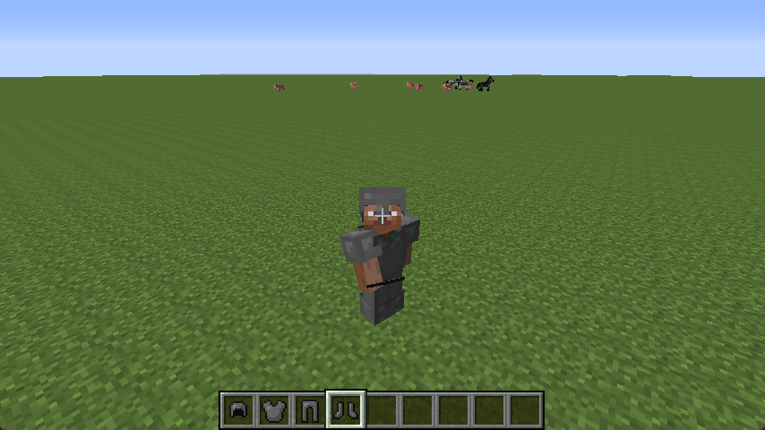

# 盔甲

这一章节中，我们将学习创建一套盔甲。

[**章节相关源码**](https://github.com/AmarokIce/NewbModding1710/blob/ModDev/src/main/java/club/snowlyicewolf/modding1710/common/item/ItemArmorsExample.java)  

## 创建全身盔甲物品

与工具一样，盔甲也拥有一套材质系统。不过与高版本不同，在 1.7.10 中，盔甲有自己的材质系统。没错，`ToolMaterial`。  
我们将会使用铁材质作为演示。当然，先来研究我们将要用到的父类：`ItemArmor`。

```java title="ItemArmor.class"
public ItemArmor(ItemArmor.ArmorMaterial material, int renderIndex, int armorType)
{
    this.material = material;
    this.armorType = armorType;
    this.renderIndex = renderIndex;
    this.damageReduceAmount = material.getDamageReductionAmount(armorType);
    this.setMaxDamage(material.getDurability(armorType));
    this.maxStackSize = 1;
    this.setCreativeTab(CreativeTabs.tabCombat);
    BlockDispenser.dispenseBehaviorRegistry.putObject(this, dispenserBehavior);
}
```

而关于 `renderIndex` 与 `armorType`，我们得到了 Forge 提供的解释：

```java title="ItemArmor.class"
/** Stores the armor type: 0 is helmet, 1 is plate, 2 is legs and 3 is boots */ // (1)
public final int armorType;

/**
 * Used on RenderPlayer to select the correspondent armor to be rendered on the player: 0 is cloth, 1 is chain, 2 is
 * iron, 3 is diamond and 4 is gold.
 */ // (2)
public final int renderIndex;
```

1. 0 为头盔，1 为胸甲，2 为护腿，3 为靴子。
2. 对应渲染玩家的护甲类型，0 为布料（皮革），1 为锁链，2 为铁，3 为钻石，4 为黄金。

但事实上，我们并不需要使用 `renderIndex` 或者设法为 `renderIndex` 注册一种新的类型。可能有点奇怪，但现在需要关注的应该是 `Item`，而不是 `ItemArmor`——因为我们将会使用一些 Forge 额外注入的方法，而这些方法被统一的注入到了 `Item` 中。现在我们进入 `Item` 之后往下拉，直到看到 Forge 注解的分割线。我们找到这个方法：

```java title="Item.class"
/**
 * Called by RenderBiped and RenderPlayer to determine the armor texture that
 * should be use for the currently equiped item.
 * This will only be called on instances of ItemArmor.
 *
 * Returning null from this function will use the default value.
 *
 * @param stack ItemStack for the equpt armor
 * @param entity The entity wearing the armor
 * @param slot The slot the armor is in
 * @param type The subtype, can be null or "overlay"
 * @return Path of texture to bind, or null to use default
 */
public String getArmorTexture(ItemStack stack, Entity entity, int slot, String type)
{
    return null;
}
```

稍后，我们的盔甲纹理将要放在这里。在完成盔甲之前，请记住这个方法的存在。那么我们现在开始编写我们的盔甲物品类：

```java title="ItemArmorsExample"
public ItemArmorsExample(int armorType) {
    super(ArmorMaterial.IRON, 0, armorType);
    String name = "example_armor_";
    switch(armorType) {
        case 0:
            name += "helmet";
            break;
        case 1:
            name += "chestplate";
            break;
        case 2:
            name += "leggings";
            break;
        case 3:
            name += "boots";
            break;
    }
    this.setUnlocalizedName(name);
    this.setTextureName(ModMain.ID + ":" + name);
    this.setCreativeTab(ModMain.TAB);
    InitItems.registerItem(name, this);
}

@Override
public String getArmorTexture(ItemStack stack, Entity entity, int slot, String type) {
    // TODO
    return null;
}
```

演示中采用 `switch` 提供一种便于注册对应盔甲的名称的方式，当然，如果读者愿意美观一些，也可以使用 `ImmutableList` 或 `String Array` 按照盔甲类型排序来供应名称。  
现在，只需要按顺序对 0-3 注册盔甲即可。当然，因为我们还没提供纹理，目前默认采用了布料纹理。


## 为盔甲附加一套纹理

现在，我们得去采取一套盔甲的纹理。请注意，盔甲纹理采用的是 `BoxUV`，因此读者应该严格按照现有模板重新制作。  
我们从原版文件夹中提取一套铁质盔甲改色，然后注册纹理：


```java title="ItemArmorsExample.java"
@Override
public String getArmorTexture(ItemStack stack, Entity entity, int slot, String type) {
    return slot != 2
        ? ModMain.ID + ":textures/armors/example_armor_layer_1.png"
        : ModMain.ID + ":textures/armors/example_armor_layer_2.png";
}
```


