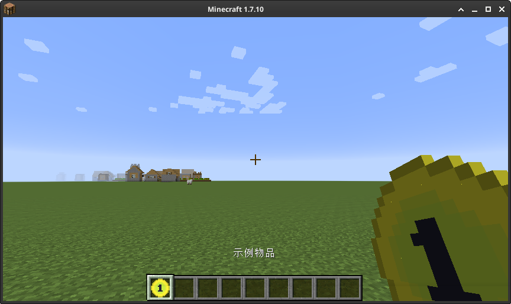

# 第一个物品

这一章节我们将会创建我们在 1.7.10 模组开发中的第一个物品。

[**章节相关源码: 创建**](https://github.com/AmarokIce/NewbModding1710/blob/ModDev/src/main/java/club/snowlyicewolf/modding1710/common/item/ItemExample.java)  
[**章节相关源码: 注册**](https://github.com/AmarokIce/NewbModding1710/blob/ModDev/src/main/java/club/snowlyicewolf/modding1710/init/ItemInit.java)

## 创建一个物品

在[重要概念](../core.md)中我们了解过了物品与方块的注册, 那么现在我们就可以来制作一些属于我们的物品了!
首先回到工作区, 创建类 `ItemExample`, 并继承 `Item`, 看起来就像这样：

```java title="ItemExample.java"
public class ItemExample extends Item {
    // Code ...
}
```

这样, 第一个 Item 就完成了!没错, 就这么简单!但是, 我们还有些事情要做, 让我们为它创建构造方法并提交本地化名称 (`UnlocalizedName`) 与纹理名称 (`TextureName`)。

```java title="ItemExample.java"
public class ItemExample extends Item {
    public ItemExample() {
        final String name = "example_item";
        // 设置本地化键。
        this.setUnlocalizedName(name);
        // 设置贴图资源。
        this.setTextureName(ModMain.ID + ":" + name);
    }
}
```

最后, 再用一个我们喜欢的方式来注册它, 一切完成！现在我们可以用指令 `give` 获取我们刚才创建的物品：


不过此时，我们手上的还是黑紫方块。虽然我们设置了纹理名称，但是我们还没加入纹理。接下来我们加入一些资源文件让它看起来很好。

## 资源文件

### 语言文件
现在, 让我们进入 resources 文件夹, 创建文件夹 `assets/读者的 ModID/` , 再分别创建文件夹 `lang` 和 `textures/items/`。
在 `lang` 文件夹中创建文件 `en_US.lang` 与 `zh_CN.lang`, 这两份文件就是我们的语言文件了, 而其名称着对应国家语言缩写。

> **lang 文件的语法约定:**
> lang 文件中, 对于物品, 其键值为 `item.本地化名.name`, 而方块为 `tile.本地化名.name`。
> 
> 而格式则是直接在键后加上=, 之后的内容无论是什么都将会是值, 不可包涵换行符或多行编写。<br />
> 我们使用 # 作为注解。

我们的物品的本地化键名是 `example_item`，那么实际就是 `item.example_item.name`。现在，我们在刚创建的文件分别输入以下内容：

```lang title="en_US.lang"
item.example_item.name=Example Item
```

```lang title="zh_CN.lang"
item.example_item.name=示例物品
```

!!! success "关于语言文件"
    当 Minecraft 无法找到适合的语言时, 就会尝试使用 `en_US.lang`。如果连 `en_US.lang` 也不存在, 则会直接显示本地化键名。

### 纹理文件

现在, 让我们分配一个材质.我们设定的材质名称是 `example_mod_id:example_item`, 那么加入 items 文件夹的材质应当命名为 `example_item.png`. 只需要把他放进去就好, 一切完成!

```markdown
resources
├── assets
│   └── examplemod
│       ├── lang
│       │   ├── en_US.lang
│       │   └── zh_CN.lang
│       └── textures
│           └── items
│               └── example_item.png
└── mcmod.info
```

现在就可以看到我们的物品的贴图与名称了！


