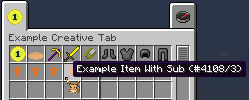
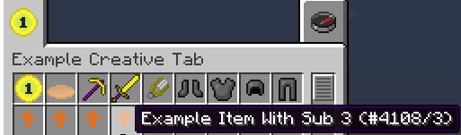
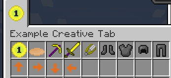

# 带元数据区分的子物品

读者应该知道在 1.7.10 版本中，所有物品都还是采用 ID 记录的形式——即便我们已经有注册名了。那么这一章节我们将要学习提供一些带元数据区分的物品，这将非常有利于我们节约 ID。

[**章节相关源码**](https://github.com/AmarokIce/NewbModding1710/blob/ModDev/src/main/java/club/snowlyicewolf/modding1710/common/item/ItemExampleWithSubItem.java)

## 请求记录元数据

首先我们创建一个物品，看起来和 `ItemExample` 非常相似：

```java title="ItemExampleWithSubItem.java"
public class ItemExampleWithSubItem extends Item {
    public ItemExampleWithSubItem() {
        final String name = "example_item_with_sub_item";
        this.setUnlocalizedName(name);
        this.setTextureName(ModMain.ID + ":" + name);
        this.setCreativeTab(ModMain.TAB);
        InitItems.registerItem(name, this);

        // 在这告知我们拥有子物品
        this.setHasSubtypes(true);
    }
}
```

是的，我们多了一行：`this.setHasSubtypes(true)`。这一行将会为物品登记这个物品拥有具有元数据分辨的物品。  
对于那些热衷于尝试的读者，可能先前已经尝试过使用这些东西了，会感觉好像这个申请有没有都一样，貌似不影响创建元数据物品？  
很好的尝试！不过作为开发者，我们需要知道遵守规范是必要的——不要嫌麻烦。既然我们需要遵守这样的规范，这意味着这一段并不是 Minecraft 的神秘代码，让我们看看它的用处：

```java title="Item.class"
public boolean getHasSubtypes()
{
    return this.hasSubtypes;
}

public boolean isDamageable()
{
    return this.maxDamage > 0 && !this.hasSubtypes;
}
```

如果其他模组广泛的扫描物品，想知道取得的物品是否有子数据，但我们没有这么做，那么那个模组必然就不能知道我们的物品有没有依照元数据区分的物品了。同时，Minecraft 也不能知道是否应该把当前物品列为可损坏的物品。

## 创建元数据物品

既然我们知道了如何请求，那么现在就让我们创建一个元数据物品。现在，让我们看向方法 `Item#getSubItems`。

```java title="Item.class"
public void getSubItems(Item p_150895_1_, CreativeTabs p_150895_2_, List p_150895_3_) {
    super.getSubItems(p_150895_1_, p_150895_2_, p_150895_3_);
}
```

读者应该已经习惯了没有类型的 `List，确定` `List` 的真实类型就是通过找到当前方法调用源的上下文。我们进入最顶层调用源 `GuiContainerCreative`，通过检查上下文，可以看到，当前 `List` 提取得到的数据是 `ItemStack`。
而这个 `List` 的真实作用就是注册元数据。总之，让我们开始注册物品。通常情况下请不要使用 `this`。

```java title="ItemExampleWithSubItem.java"
@Override
public void getSubItems(Item self, CreativeTabs tab, List list) {
    for (int i = 0; i < 4; i++) {
        list.add(new ItemStack(self, 1, i));
    }
}
```



## 为子物品们提供不同的名称与纹理

### 创建名称

我们已经学会了如何节约 ID 创建超多物品，现在让我们看看如何它们创建不同的名称与纹理！

相信读者应该已经知道怎么做了——如果还没有头绪的话，没关系，我们逐个分析。  
既然我们有 `setUnlocalizedName`，那么我们必然会有 `getUnlocalizedName`。我们来看看 `Item` 类的方法：

```java title="Item.class"
/**
 * Returns the unlocalized name of this item.
 */
public String getUnlocalizedName()
{
    return "item." + this.unlocalizedName;
}

/**
 * Returns the unlocalized name of this item. This version accepts an ItemStack so different stacks can have
 * different names based on their damage or NBT.
 */
public String getUnlocalizedName(ItemStack p_77667_1_)
{
    return "item." + this.unlocalizedName;
}
```

现在，我们需要更具物品的 `Meta` 区分物品名称，我们应该覆写哪个方法？

聪明的读者肯定已经知道，我们需要覆写下面那个，毕竟一切都已经被写入文档了。

```java title="ItemExampleWithSubItem.java"
@Override
public String getUnlocalizedName(ItemStack stack) {
    return super.getUnlocalizedName(stack) + "_" + stack.getItemDamage();
}
```



### 创建纹理

创建纹理会略比更改名称要麻烦一些，因为我们还需要向 Minecraft 注册我们的纹理。不过，我们可以在 `Item` 中完成注册。

```java title="Item.class"
@SideOnly(Side.CLIENT)
public void registerIcons(IIconRegister p_94581_1_)
{
    this.itemIcon = p_94581_1_.registerIcon(this.getIconString());
}
```

看来，这里正在注册我们透过 `setTextureName` 提交的名称。放心，这里只是注册，我们并不需要取得 `ItemStack`，所以不要再寻找是否有 `ItemStack` 的注册方法了。让我们先创建三个额外的 `IIcon`，然后分别注册：

```java title="ItemExampleWithSubItem.java"
@SideOnly(Side.CLIENT) private IIcon icon1;
@SideOnly(Side.CLIENT) private IIcon icon2;
@SideOnly(Side.CLIENT) private IIcon icon3;

@Override
@SideOnly(Side.CLIENT)
public void registerIcons(IIconRegister register) {
    super.registerIcons(register);

    icon1 = register.registerIcon(this.getIconString() + "_" + 1);
    icon2 = register.registerIcon(this.getIconString() + "_" + 2);
    icon3 = register.registerIcon(this.getIconString() + "_" + 3);
}
```

注册完纹理，我们继续寻找获取它们的方法。这一搜，获取纹理的方法也太多！好吧，这一部分会放在进阶开发的章节中细细的解析，直至目前，我们需用到的是 `Item#getIconFromDamage` 方法。

```java title="ItemExampleWithSubItem.java"
@Override
@SideOnly(Side.CLIENT)
public IIcon getIconFromDamage(int meta) {
    switch (meta) {
        case 1: return this.icon1;
        case 2: return this.icon2;
        case 3: return this.icon3;
        case 0:
        default: return this.itemIcon;
    }
}
```

!!! abstract "想要了解更多关于 `getIcon` 相关的内容吗？这一部分将会在进阶开发的章节中继续解析！"



### 拓展阅读：我们还需要 `setUnlocalizedName` 与 `setTextureName` 吗？

如果在各种 getter 中均为调取本地的变量，那么读者应该不需要这么做了。因为这里已经提交了必要的数据，Minecraft 已经知道想要什么了。

这就是 getter 与 setter 多态化编程的魅力！在日后的编程中也应该多多善用 getter 与 setter！
