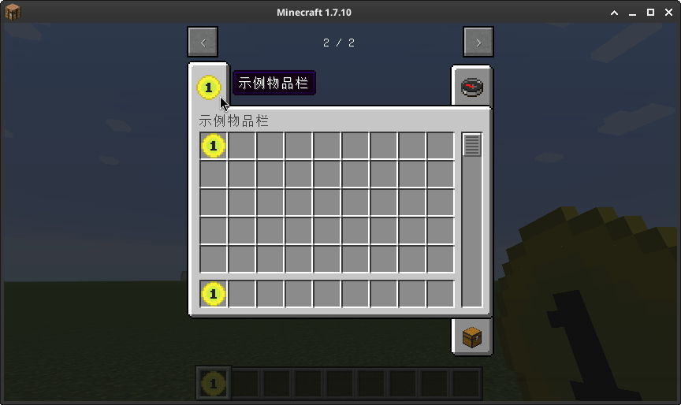

# 创造模式物品栏

这一章节我们将会学习如何把物品放进创造模式物品栏，以及创建一个我们自己的创造模式物品栏。

[**章节相关源码**](https://github.com/AmarokIce/NewbModding1710/blob/ModDev/src/main/java/club/snowlyicewolf/modding1710/util/BeanCreativeTab.java)

## 将物品加入创造模式物品栏组

添加到现有的创造模式物品栏非常简单，只需要调用 Item 下的 `Item#setCreativeTab` 即可。  
现在，我们把刚注册的物品加入杂项类物品栏：

```java title="ItemExample.java"
public ItemExample() {
    this.setCreativeTab(CreativeTabs.tabMisc);
    /* 其他代码 */
}
```

!!! success "1.7.10 中每个物品通常只会有一个创造模式物品栏，但是你可以通过覆写 `getCreativeTabs` 达到跨越多个物品栏的效果。"


## 创建一个新的创造模式物品栏

通过实例化 `CreativeTabs` 方法可以完成创建一个全新的, 属于我们的创造模式物品栏。**不过要注意的是，1.7.10 中创建 `CreativeTabs` 的时机非常敏感，因此建议直接使用实例化类的方式创建，而不是通过方法创建。**  
`CreativeTabs` 是一个抽象类, 因此除了可以通过创建新的类后继承, 再实例化实例类。不过我们也可以直接通过 `Lambda 表达式` 来实例化抽象类. 这样会更方便, 下面会演示使用 `Lambda` 创建一个 CreativeTabs:

```java title="ModMain.java"
public static final CreativeTabs TAB = new CreativeTabs("example_item_group") {
    @Override
    public Item getTabIconItem() {
        return ItemInit.ITEM_EXAMPLE;
    }
};
```
如果我们有多个组，这样写 `lambda` 的话代码依然会很脏。因此我们来编写一个种子工厂来供应类：

```java title="BeanCreativeTab.java"
public class BeanCreativeTab extends CreativeTabs {
    private final Supplier<Item> itemIcon;

    public BeanCreativeTab(final String name, final Supplier<Item> item) {
        super(name);
        this.itemIcon = item;
    }

    @Override
    public Item getTabIconItem() {
        return this.itemIcon.get();
    }
}

```

```java title="ModMain.java"
public static final CreativeTabs TAB = new BeanCreativeTab("example_item_group", () -> InitItems.ITEM_EXAMPLE);
```

现在我们可以为 ItemExample 设定我们刚才设定的组:

```java title="ItemExample.java"
public ItemExample() {
    this.setCreativeTab(ModMain.TAB);

    /* 其他代码 */
}
```

??? question "为什么这里使用了 `Supplier` ?"
    这里调用的目标物品也是我们将要加入的物品，由于这里创建创造模式物品栏是即时且静态的。为了防止竞争注册，需要使用 `Supplier` 惰性供应。但注意，创造模式物品栏不应晚于物品注册，否则物品将会持有空指针，此时也会被列为无物品栏物品。

!!! note "创造模式物品组的名称键为 `itemGroup.注册的名称` ."

现在再次进入游戏，我们就可以看到效果了：


