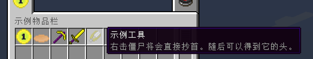

# 工具与武器

这一章节中，我们将学习创建一把镐与剑，以及一些特殊的，诸如剪刀这样的工具。

[**章节相关源码：镐**](https://github.com/AmarokIce/NewbModding1710/blob/ModDev/src/main/java/club/snowlyicewolf/modding1710/common/item/ItemFoodExample.java)  
[**章节相关源码：剑**](https://github.com/AmarokIce/NewbModding1710/blob/ModDev/src/main/java/club/snowlyicewolf/modding1710/common/item/ItemFoodExample.java)  
[**章节相关源码：特殊工具**](https://github.com/AmarokIce/NewbModding1710/blob/ModDev/src/main/java/club/snowlyicewolf/modding1710/common/item/ItemToolExample.java)

## 创建一把镐子

在正式开始之前，我们先来复习一下工具的材质。

读者应该还能记得，我们的镐子会从木镐，到石镐，再到铁镐，最后是钻石镐，而这些镐子的区别在于它们的材质不同，而它们的挖掘效率与挖掘等级也不同。木镐是 0 级，而石镐是 1，铁镐是 2,钻石镐则是 3。这些称之为采收等级。

现在让我们看看工具材质的枚举类 `ToolMaterial`，当然，我已经把 `Srg 名` 翻译过来了：

```java title="ToolMaterial.class"
public static enum ToolMaterial
{
    WOOD(0, 59, 2.0F, 0.0F, 15),
    STONE(1, 131, 4.0F, 1.0F, 5),
    IRON(2, 250, 6.0F, 2.0F, 14),
    EMERALD(3, 1561, 8.0F, 3.0F, 10),
    GOLD(0, 32, 12.0F, 0.0F, 22);

    private ToolMaterial(int harvestLevel, int maxDamage, float efficiency, float damage, int enchantability)
    {
        this.harvestLevel = harvestLevel;               // 采收等级。
        this.maxUses = maxDamage;                       // 最大耐久。
        this.efficiencyOnProperMaterial = p_i1874_5_;   // 采收效率。
        this.damageVsEntity = damage;                   // 造成伤害。
        this.enchantability = enchantability;           // 附魔等级。
    }
}
```

我们一共有五样默认的工具材质，那么我们就挑选中规中矩的铁材质来制作我们的第一把工具和武器吧。

事实上，在 1.7.10 中读者需要关心的部分都有独立的类，应该不难猜到我们接下来的步骤就是继承目标类型 `ItemPickaxe`，然后重复一便物品设定贴图：

```java title="ItemPickaxeExample.java"
public class ItemPickaxeExample extends ItemPickaxe {
    public ItemPickaxeExample() {
        super(ToolMaterial.IRON);

        final String name = "example_pickaxe";
        this.setUnlocalizedName(name);
        this.setTextureName(ModMain.ID + ":" + name);
        this.setCreativeTab(ModMain.TAB);
        InitItems.registerItem(name, this);
    }
}
```

### 修改细节属性

等等，如果我们不喜欢工具材质里定义的数据，想要修改某一部分，岂不是要重新写一个新的材质？

不，其实不需要。事实上，虽然工具材质里定义了一切，但实际这些内容如何被处理依然会被写到物品类本身。工具材质最大的用途还是用于定义工具应该会被使用何种材料修复。  
让我们深入 `ItemPickaxe`，让我们看看父类，工具物品 `ItemTool` 是如何处理这些数据的，当然，别忘记在工作区里看到的应该是 `Srg 名`：

```java title="ItemTool.class"
protected ItemTool(float baseDamage, Item.ToolMaterial toolMaterial, Set defHarvestBlockSet)
{
    this.toolMaterial = toolMaterial;                                               // 持有工具材质。
    this.field_150914_c = defHarvestBlockSet;                                       // 可挖掘的方块。
    this.maxStackSize = 1;                                                          // 最大堆叠为 1。
    this.setMaxDamage(toolMaterial.getMaxUses());                                   // 设置最大耐久。
    this.efficiencyOnProperMaterial = toolMaterial.getEfficiencyOnProperMaterial(); // 设置采集效率。
    this.damageVsEntity = baseDamage + toolMaterial.getDamageVsEntity();            // 基本伤害加上材质伤害，得到武器伤害。
    this.setCreativeTab(CreativeTabs.tabTools);                                     // 设置创造模式物品栏。
    if (this instanceof ItemPickaxe)                                                // 工具类型，我们会在方块创建章节更详细的聊聊这个。
    {
        toolClass = "pickaxe";
    }
    else if (this instanceof ItemAxe)
    {
        toolClass = "axe";
    }
    else if (this instanceof ItemSpade)
    {
        toolClass = "shovel";
    }
}
```

如你所见，诸如耐久，采收效率等数据最终都由物品自身管理，这意味着我们可以覆写它们。以耐久为例，让我们刚创建的镐子拥有非常臭的耐久：

```java title="ItemPickaxeExample.java"
public ItemPickaxeExample() {
    super(ToolMaterial.IRON);

    this.setMaxDamage(114514);

    /* 其他代码 */
}
```

在香草中，几乎把全部判断类型都集合到一个类了，但我们并不需要这么做。来看看 `ItemPickaxe` 中覆写的两个方法：`func_150897_b` 与 `func_150893_a`，分别代表“是否可挖掘”与“挖掘效率”。  
刚才读者应该看到了上面有一段 `this.field_150914_c` 代表“可挖掘的方块”，这个字段便是在这个地方被处理，但我们不需要这么麻烦——如果想让镐子能够处理任何方块，那么我们只需要让 `func_150897_b` 返回 `true` 即可：

```java title="ItemPickaxeExample.java"
@Override
public boolean func_150897_b(Block pBlock) {
    return true;
}
```

### 使工具不会损坏

当 NBT 中存在值为 `Boolean` 且为 `true`，名为 `Unbreakable` 的数据时，武器将会是不可摧毁的。  
当然，可以让武器耐久为 `-1`，此时会被记作不可损坏的物品。

## 创建一柄剑

与创建一把镐子一样，我们先来解决掉基本内容。

```java title="ItemSwordExample.java"
public class ItemSwordExample extends ItemSword {
    protected ItemSwordExample() {
        super(ToolMaterial.IRON);

        final String name = "example_sword";
        this.setUnlocalizedName(name);
        this.setTextureName(ModMain.ID + ":" + name);
        this.setCreativeTab(ModMain.TAB);
        InitItems.registerItem(name, this);
    }
}
```

### 为剑增加剧毒

一把剑看起来太普通了，不是吗？我们可以修改剑击中目标时的情况，为目标施加剧毒。不过要注意，如果玩家是创造模式，那么应该什么也不做... 除非读者真的打算这么做。  
先来看看 `ItemSword` 中的方法，应该很快就能看到我们所期望的目标方法了：`hitEntity`。

```java title="ItemSword.class"
/**
 * Current implementations of this method in child classes do not use the entry argument beside ev. They just raise
 * the damage on the stack.
 */
public boolean hitEntity(ItemStack p_77644_1_, EntityLivingBase p_77644_2_, EntityLivingBase p_77644_3_)
{
    p_77644_1_.damageItem(1, p_77644_3_);
    return true;
}
```

我们只需要覆写 `Item#hitEntity` 就可以得到攻击时将会发生的事情，这个方法默认包含了剑消耗耐久。

```java title="ItemSwordExample.java"
@Override
public boolean hitEntity(ItemStack pStack, EntityLivingBase pUser, EntityLivingBase pTarget) {
    if (pTarget instanceof EntityPlayer && ((EntityPlayer) pTarget).capabilities.isCreativeMode) {
        return false;
    }
    pTarget.addPotionEffect(new PotionEffect(Potion.poison.getId(), 20 * 30, 0)); // 施加 30 秒的剧毒效果。
    return hitEntity(pStack, pUser, pTarget);
}
```

## 工具之外

虽然 `ItemTool` 是工具物品的代名词，但不代表我们的工具必须是 `ItemTool`，就像是剪刀和打火石，它们没有材质。  
现在让我们来设计一种把僵尸脑袋取下来的工具，它在玩家手持并按下右键时会把僵尸削首。

与任何时候一样，我们先再次深入 `Item` 去查询一些我们想要的方法。

```java title="Item.class"
/**
 * Returns true if the item can be used on the given entity, e.g. shears on sheep.
 */
public boolean itemInteractionForEntity(ItemStack p_111207_1_, EntityPlayer p_111207_2_, EntityLivingBase p_111207_3_)
{
    return false;
}
```

注解中甚至已经举例了见到，显然这就是我们需要的那个方法，再次和任何时候一样，我们需要覆写它，同时别忘记我们需要手动设定耐久损耗：

```java title="ItemToolExample.java"
@Override
public boolean itemInteractionForEntity(ItemStack pStack, EntityPlayer pPlayer, EntityLivingBase pEntity) {
    // 如果不是僵尸就直接取消方法。
    if (!(pEntity instanceof EntityZombie)) {
        return false;
    }

    // 在僵尸所在位置生成头颅掉落物。僵尸头颅的元数据为 2。
    final ItemStack head = new ItemStack(Blocks.skull, 1, 2);
    final EntityItem itemEntity = new EntityItem(pEntity.worldObj, pEntity.posX, pEntity.posY, pEntity.posZ, head);
    pEntity.worldObj.spawnEntityInWorld(itemEntity);

    // 使僵尸死亡。
    pEntity.setDead();
    // 通知实体已经死亡，同步状态。
    pEntity.worldObj.setEntityState(pEntity, (byte) 3);

    // 发出剪刀的声音。
    pEntity.playSound("mob.sheep.shear", 1.0F, 1.0F);
    // 损耗工具
    pStack.damageItem(1, pEntity);
    return true;
}
```

不过光这样玩家们可能不知道这个东西要怎么用，应此我们来为它增加一个介绍。  
只需要覆写 `Item#addInformation` 即可。不过由于 Minecraft 被开发出来的时候 Java 并没有泛型，应此此处 `List` 是一个无类型列表。但这不代表我们可以随意加入物品。这里的真实类型是 `String`。不过硬编码不是好习惯，应此我们来 i18n 一下。我们有两种方式处理翻译文本：使用 `I18N`，或者使用 `ChatComponent`。非常推荐后者，这样可以为文本方便的增加效果... 其实在文本文件中加入小节符号（也就是 MC 格式符号）也是一样的。  
此处我们使用 `ChatComponent` 做演示：

```java title="ItemToolExample.java"
// 参数位分别代表当前物品的 ItemStack（可能是空的）,检查物品的玩家，介绍列表，是否显示高级数据（F3 + H）
@Override
public void addInformation(@CheckForNull ItemStack pStack, EntityPlayer pPlayer,
                           List pTooltipInfos, boolean pFlag) {
    pTooltipInfos.add(new ChatComponentTranslation("item.exampletool.info")
        .getFormattedText());
}
```




## 章节练习

至此，读者已经掌握了基本的模组开发内容，下一章节我们将会学习如何制作一套盔甲。  
在此之前，请尝试使用目前所学知识，通过深入翻阅 `Item` 类中所包含的方法，独立完成练习，请听题：

> 请使用你所学的内容，制作一个全新的，独立的工具类型。它的材质是铁制品，并且可以代替打火石生火。它拥有 243 点耐久，并且最大堆叠数量为 1。使用它攻击任何生物都将造成三秒的燃烧效果。

答案将会在下一章节末公开。
