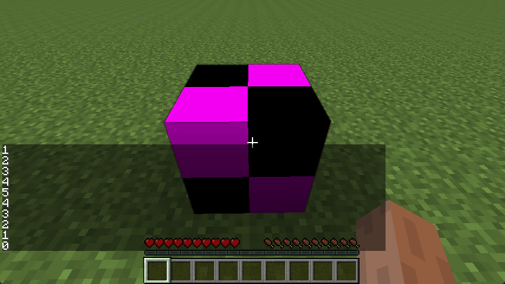

# 方块与方块实体

过去的章节中我们学习了如何创建方块，这一章我们将要学习如何为方块搭配一个方块实体。

[**章节相关源码: 创建**](https://github.com/AmarokIce/NewbModding1710/blob/ModDev/src/main/java/club/snowlyicewolf/modding1710/common/tile/TileExample.java)  
[**章节相关源码: 注册**](https://github.com/AmarokIce/NewbModding1710/blob/ModDev/src/main/java/club/snowlyicewolf/modding1710/init/InitBlocks.java)

## 什么是方块实体

通常来讲我们的方块不存储任何数据，由于 1.7.10 甚至没有 `BlockState` 的概念，数据存储自然是无望直接挂载到 `Block` 中。  
但对于任何需要存储数据的，例如箱子，或者熔炉，那么我们就需要方块实体。  
方块实体除了能够存储数据，也能够可选性的登记每个 `tick` 将要处理的事物，以及提供特殊的渲染工具。

> 关于特殊渲染，相关内容将会在进阶开发中提及。

!!! failure 以防读者不知道，工作台从来都不是方块实体。

!!! tip 或许在更高的版本中接触到的是 `BlockEntity`，但是请注意，现在我们依然叫 `TileEntity`。当与其他人聊起方块实体的时候，或许读者应该称其为 `Tile` 而不是 `BlockEntity。`

## 创建方块实体

虽然在 1.7.10 中，`world` 参数与 `meta` 参数不是必要的，通常情况下 Minecraft 会自动填充它们。但是，规范一些总是没错不是吗？

```java title="TileExample.java"
public class TileExample extends TileEntity {
    public TileExample(World world, int meta) {
        this.setWorldObj(world);
        this.blockMetadata = meta;
    }
}
```

然后我们需要在目标的方块中绑定它。首先我们需要继承 `BlockContainer` 或者实现接口 `ITileEntityProvider`：

```java title="BlockExampleWithTile.java"
public class BlockExampleWithTile extends BlockContainer {
    public BlockExampleWithTile() {
        super(Material.rock);

        final String name = "example_tile_block";

        this.setBlockName(name);
        this.setBlockTextureName(ModMain.ID + ":" + name);
        this.setCreativeTab(ModMain.TAB);

        InitBlocks.registerBlock(name, this);
    }

    @Override
    public TileEntity createNewTileEntity(World pWorld, int pMeta) {
        return new TileExample(pWorld, pMeta);
    }
}
```

最后，我们只需要注册它们即可：

```java title="InitBlocks.java"
// 注册全部方块。
public static void init() {
    BLOCKS.forEach(GameRegistry::registerBlock);
    initTileEntity();
}

private static void initTileEntity() {
    GameRegistry.registerTileEntity(TileExample.class, "example_tile");
}
```

## 方块实体的数据存储

总之，我们已经完成了一个方块实体的创建，但是现在它看起来还没有任何存储数据的能力——顶多就是一个特殊渲染的载体。  
所以，现在我们需要为它提供一个计数能力。那么，先请读者思考一下，如果我们需要做一个计数，需要先做什么？  
当然，创建一个变量！先在我们刚才创建的 `TileEntity` 中创建这这个变量，然后再来考虑一下别的事情。  
我是说，我们还需要存储这样的变量不是吗？否则在我们推出游戏，变量就消失了。

```java title="TileExample.java"
public class TileExample extends TileEntity {
    private int count = 0;

    public TileExample(final World world, final int meta) {
        this.setWorldObj(world);
        this.blockMetadata = meta;
    }

    public int getCount() {
        return count;
    }

    public void addCount() {
        count++;
    }

    public void modifyCount() {
        // 为了不让 count 小于 0，我们需要限制底线。
        count = Math.max(count - 1, 0);
    }
}
```

现在，我们得到了一个雏形，这样就已经可以开始写下一步实现了。不过先等等，就像是刚才提到的，如果我们推出游戏，数据就消失了。我们先来编写一个数据存储：

```java title="TileExample.java"
// 这里用于存储数据
@Override
public void writeToNBT(NBTTagCompound nbt) {
    super.writeToNBT(nbt);
    nbt.setInteger("count", count);
}

// 这里用于读取数据
@Override
public void readFromNBT(NBTTagCompound nbt) {
    super.readFromNBT(nbt);
    count = nbt.getInteger("count");
}
```

好了！现在我们开始编写方块部分于这个方块实体交互：

```java title="BlockExampleWithTile.java"
    // 这里用于处理玩家右键方块时将要做的。
@Override
public boolean onBlockActivated(World pWorld, int pPosX, int pPosY, int pPosZ,
                                EntityPlayer pUser, int pFace, float pHitX,
                                float pHitY, float pHitZ) {
    // 检查是否为服务端。当 isRemote 为 True 时为客户端，因此提前返回。
    if (pWorld.isRemote) {
        return true;
    }

    // 检查 TileEntity 是否为我们需要的，为了避免任何意外。每次采取 TileEntity 时都应该注意检查。
    final TileEntity tileEntity = pWorld.getTileEntity(pPosX, pPosY, pPosZ);
    if (!(tileEntity instanceof TileExample)) {
        return false;
    }

    // 投射过去。
    final TileExample tile = (TileExample) tileEntity;
    tile.addCount();

    // 输出我们的消息
    pUser.addChatMessage(new ChatComponentText(tile.getCount() + ""));
    return true;
}

// 这里用于处理玩家左键方块时将要做的。
@Override
public void onBlockClicked(World pWorld, int pPosX, int pPosY, int pPosZ, EntityPlayer pUser) {
    if (pWorld.isRemote) {
        return;
    }

    final TileEntity tileEntity = pWorld.getTileEntity(pPosX, pPosY, pPosZ);
    if (!(tileEntity instanceof TileExample)) {
        return;
    }

    final TileExample tile = (TileExample) tileEntity;
    tile.modifyCount();
    pUser.addChatMessage(new ChatComponentText(tile.getCount() + ""));
}
```

非常简单！不是吗？


